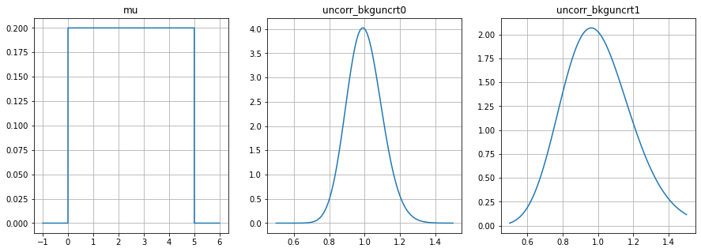

# priorhf

`priorhf` creates priors from a HF workspaces (`json`) for Bayesian inference. 

**Note**: `shapefactor` modifier are not implemented yet.

### Priors as jl.NamedTupleDist for BAT


```python
from priorhf import make_prior

prior, prior_specs = make_prior('2_bin_uncorr.json')

# jl.PosteriorMeasure(prior, likelihood) 

print(prior_specs)
```

    {'mu': <jl Uniform{Float64}(a=0.0, b=5.0)>, 'uncorr_bkguncrt0': <jl Gamma{Float64}(α=101.0, θ=0.009900990099009901)>, 'uncorr_bkguncrt1': <jl Gamma{Float64}(α=26.0, θ=0.038461538461538464)>}


### Scipy-Output (Python visualization)


```python
from priorhf import make_prior
import matplotlib.pyplot as plt
import numpy as np

priors = make_prior('2_bin_uncorr.json', typ='scipy')

fig, axs = plt.subplots(1,3, figsize=(15,5))

x = [ np.array([-1, -0.001, 0.001, 4.999, 5.001, 6]), 
      np.linspace(0.5, 1.5, 100), 
      np.linspace(0.5, 1.5, 100)]

for i, (name, prior) in enumerate(priors.items()):
    print(prior)
    axs[i].plot(x[i], prior.pdf(x[i]))
    axs[i].grid(True)
    axs[i].set_title(name)

```

    <scipy.stats._distn_infrastructure.rv_frozen object at 0x7f6836d61a20>
    <scipy.stats._distn_infrastructure.rv_frozen object at 0x7f683715c640>
    <scipy.stats._distn_infrastructure.rv_frozen object at 0x7f683715f310>


    

    


### Text-Output


```python
from priorhf import make_prior

make_prior('2_bin_uncorr.json', typ='txt')
```


    {'mu': 'Uniform(0, 5)',
     'uncorr_bkguncrt0': 'Gamma(101.0, 0.009900990099009901)',
     'uncorr_bkguncrt1': 'Gamma(26.0, 0.038461538461538464)'}


